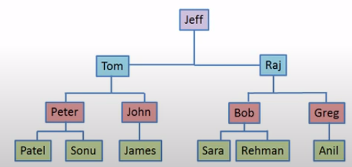

# Querys Hierárquicas

Uma query hierárquica estrutura os dados em níveis, conforme o exemplo abaixo:



## Estrutura de Querys Hierárquicas

Características de querys hierárquicas:

*   Palavras-chave: `CONNECT BY`, `PRIOR` e `START_WITH`.
    *   `START_WITH`: define o primeiro ancestral.
    *   `CONNECT BY`: define o relacionamento (atributo) que estabelece a hierarquia.
    *   `PRIOR`: utilizado como operador unário de condição do connect by. Pode haver mais de uma condição `PRIOR`. As condições são avaliadas em sequência.
*   A hierarquia é construída quando uma linha possui hierarquia sobre outra linha.
*   Há uma pseudo-coluna `LEVEL` que retorna a profundidade da hierarquia.
*   Caso a hierarquia possua loop, utilizar as opções:
    *   Pseudo-coluna `CONNECT_BY_ISCYCLE` que acusa as linhas que causam o loop.
    *   `CONNECY BY NOCYCLE` que retorna o resultado mesmo que haja ciclos na query.

*   Resumo: https://docs.snowflake.com/en/sql-reference/constructs/connect-by.html

## Exemplo de Código

```sql
SELECT employee_id, last_name, manager_id
   FROM employees
   CONNECT BY PRIOR employee_id = manager_id;
--    The keyword PRIOR indicates that the value should be taken from the prior (higher/parent) level.
--    In this example, the current employee’s manager_ID should match the prior level’s employee_ID.

-- EMPLOYEE_ID LAST_NAME                 MANAGER_ID
-- ----------- ------------------------- ----------
--         101 Kochhar                          100
--         108 Greenberg                        101
--         109 Faviet                           108
--         110 Chen                             108
--         111 Sciarra                          108
--         112 Urman                            108
--         113 Popp                             108
--         200 Whalen                           101
```

## Exemplo Resolvido

*   Problema: https://www.hackerrank.com/challenges/binary-search-tree-1/

*   Solução:

```sql
WITH T1 AS (
    SELECT
        N,
        P,
        LEVEL AS LVL
    FROM
        BST START WITH P IS NULL CONNECT BY PRIOR N = P
    ORDER BY
        LEVEL
)
SELECT
    N,
    (
        CASE
            WHEN LVL = MAX_LEVEL THEN 'Leaf'
            WHEN LVL = MIN_LEVEL THEN 'Root'
            ELSE 'Inner'
        END
    ) X
FROM
    (
        SELECT
            N,
            (
                SELECT
                    MAX(LVL)
                FROM
                    T1
            ) AS MAX_LEVEL,
            (
                SELECT
                    MIN(LVL)
                FROM
                    T1
            ) AS MIN_LEVEL,
            LVL
        FROM
            T1
    ) Z
ORDER BY
    N;
```


*   Query e retorno:

```sql
SELECT
    N,
    P,
    LEVEL AS LVL
FROM
    BST START WITH P IS NULL CONNECT BY PRIOR N = P
ORDER BY
    LEVEL

--      N       P     LVL
--      15     NULL    1
--      4       15     2
--      11      15     2
--      2       4      3
--      13      11     3
--      6       4      3
--      9       11     3
--      12      13     4
--      10      9      4
--      8       9      4
--      14      13     4
--      5       6      4
--      3       2      4
--      1       2      4
--      7       6      4
```
